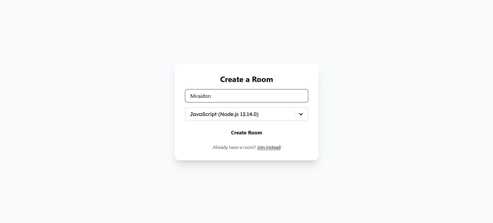
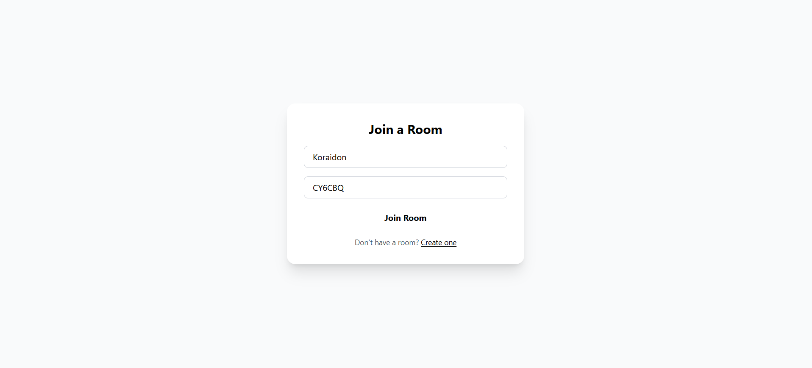
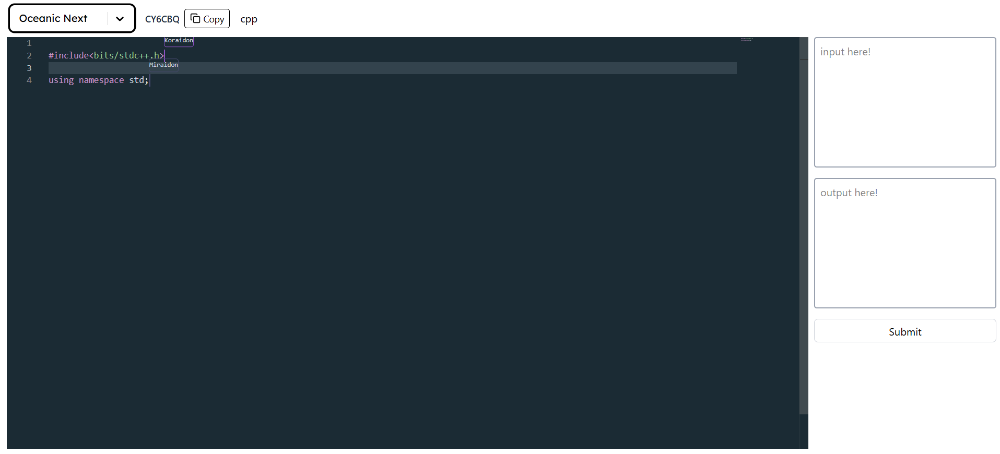
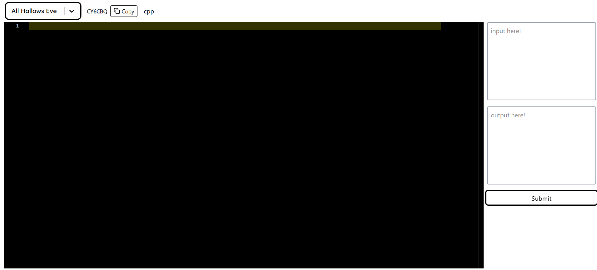

# Collaborative Code Editor

A real-time collaborative code editor built with **React**, **Monaco Editor**, **Yjs**, and **WebSocket** for distributed multi-user synchronization. Supports syntax highlighting, live cursor tracking, and shared editing with user-specific awareness and styling.

## 📦 Tech Stack

- **React** – frontend framework
- **Monaco Editor** – code editing component
- **Yjs** – CRDT-based data sync
- **y-websocket** – WebSocket server for Yjs document sync
- **Jotai** – state management
- **Tailwind CSS** – UI styling
- **Express.js** – room management backend

## 🪛 Todo
- **create env**
- **persist sessions**
- **Make the UI load faster**
- **Host application**

## Application images

